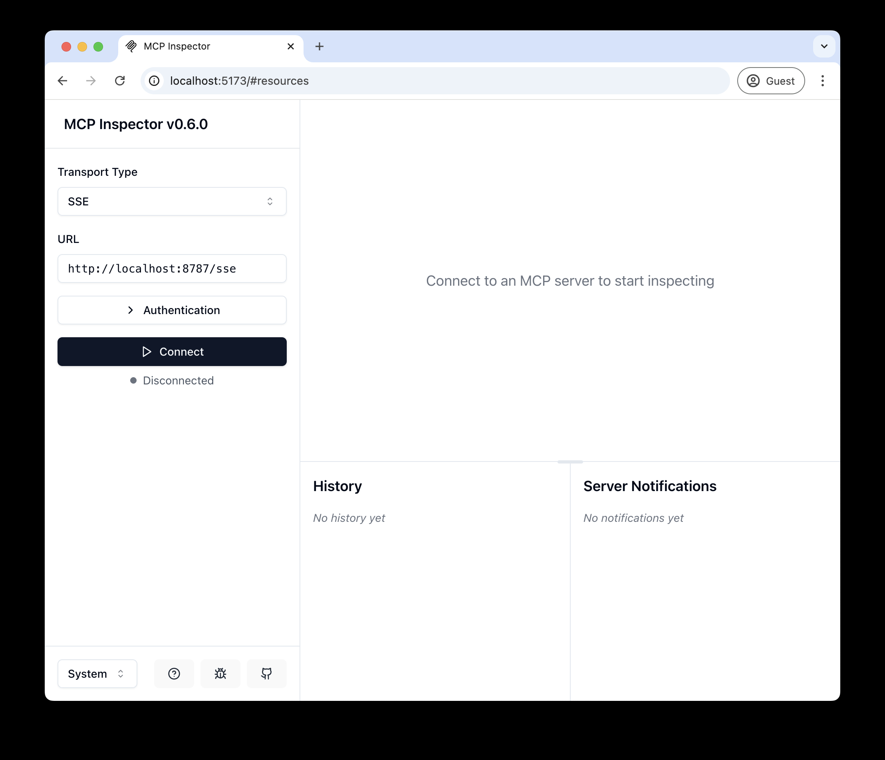
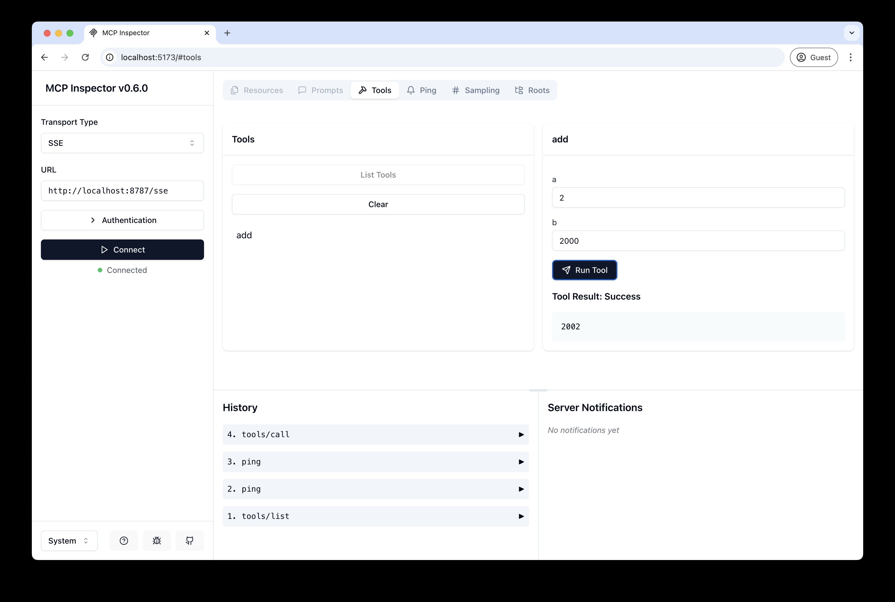
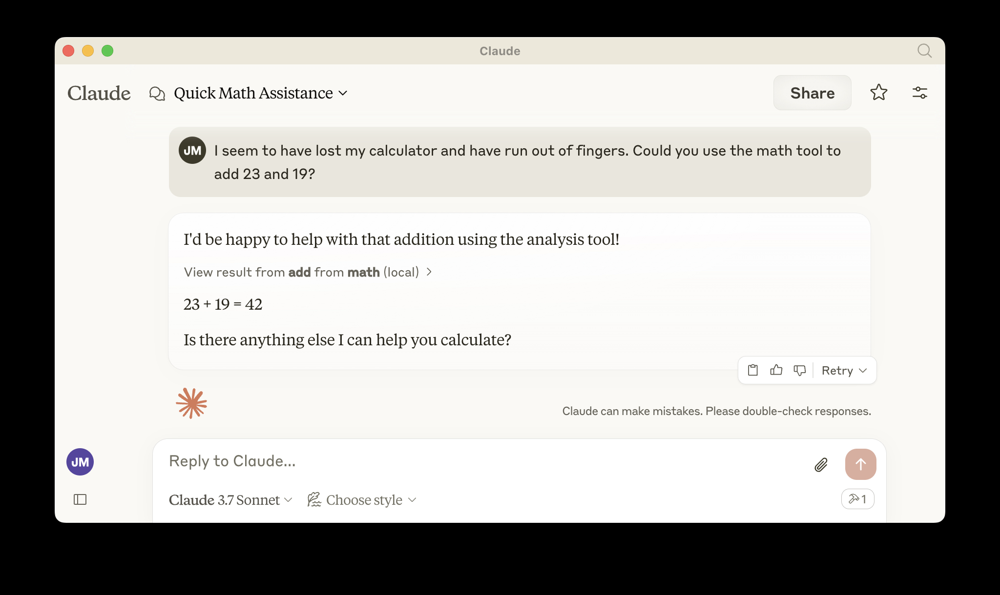

# Remote MCP Server on Cloudflare

Let's get a remote MCP server up-and-running on Cloudflare Workers complete with OAuth login!

## Develop locally

```bash
# clone the repository
git clone https://github.com/cloudflare/ai.git
# Or if using ssh:
# git clone git@github.com:cloudflare/ai.git

# install dependencies
cd ai
# Note: using pnpm instead of just "npm"
pnpm install

# run locally
npx nx dev remote-mcp-server
```

You should be able to open [`http://localhost:8787/`](http://localhost:8787/) in your browser

## Connect the MCP inspector to your server

To explore your new MCP api, you can use the [MCP Inspector](https://modelcontextprotocol.io/docs/tools/inspector).

- Start it with `npx @modelcontextprotocol/inspector`
- [Within the inspector](http://localhost:5173), switch the Transport Type to `SSE` and enter `http://localhost:8787/sse` as the URL of the MCP server to connect to, and click "Connect"
- You will navigate to a (mock) user/password login screen. Input any email and pass to login.
- You should be redirected back to the MCP Inspector and you can now list and call any defined tools!

<div align="center">
  
</div>

<div align="center">
  
</div>

## Connect Claude Desktop to your local MCP server

The MCP inspector is great, but we really want to connect this to Claude! Follow [Anthropic's Quickstart](https://modelcontextprotocol.io/quickstart/user) and within Claude Desktop go to Settings > Developer > Edit Config to find your configuration file.

Open the file in your text editor and replace it with this configuration:

```json
{
	"mcpServers": {
		"math": {
			"command": "npx",
			"args": ["mcp-remote", "http://localhost:8787/sse"]
		}
	}
}
```

This will run a local proxy and let Claude talk to your MCP server over HTTP

When you open Claude a browser window should open and allow you to login. You should see the tools available in the bottom right. Given the right prompt Claude should ask to call the tool.

<div align="center">
  
</div>

<div align="center">
  
</div>

## Deploy to Cloudflare

1. `npx wrangler kv namespace create OAUTH_KV`
2. Follow the guidance to add the kv namespace ID to `wrangler.jsonc`
3. Set the required GitHub secrets:
   - `wrangler secret put GITHUB_APP_CLIENT_ID`
   - `wrangler secret put GITHUB_APP_ID`
   - `wrangler secret put GITHUB_APP_PRIVATE_KEY`
   - `wrangler secret put GITHUB_OAUTH_CLIENT_ID`
   - `wrangler secret put GITHUB_OAUTH_CLIENT_SECRET`
   - `wrangler secret put KV_ENCRYPTION_KEY`
4. Register two GitHub integrations that share the same callback URL:
   - GitHub App: used after installation for ongoing repo contents access.
   - Classic OAuth App: used for `/authorize`, exchanges a `gho_` token with `repo` scope, and auto-creates the private vault repo before handing off to the GitHub App.
   - Callback URL: `https://marcus-mcp-server.r-df5.workers.dev/auth/github/callback`
5. `npm run deploy`

## Production assets (owner: @romacv)

Live integrations registered against the deployed worker. Bookmark these —
you'll need them to rotate secrets, edit display names, or revoke access.

| Asset | Display name | Manage URL | Notes |
|---|---|---|---|
| GitHub App | `Marcus - Auto Second Brain` | <https://github.com/settings/apps/marcus-second-brain> | Slug: `marcus-second-brain`. Owns Contents R+W on the user's vault repo. JWT `iss` = its client_id (`Iv23li…`). Reads `GITHUB_APP_CLIENT_ID`, `GITHUB_APP_ID`, `GITHUB_APP_PRIVATE_KEY`. |
| OAuth App | `Marcus — Second Brain` | <https://github.com/settings/applications/3583830> | App ID: `3583830`. Used by `/authorize` for the `gho_` user-access token with `repo` scope. Reads `GITHUB_OAUTH_CLIENT_ID`, `GITHUB_OAUTH_CLIENT_SECRET`. |
| Worker | `marcus-mcp-server` | <https://dash.cloudflare.com> → Workers & Pages → marcus-mcp-server | URL: `https://marcus-mcp-server.r-df5.workers.dev`. Account ID: `df58e5e319c3e6d92c0173d9ea1c538b`. |
| Vault repo (per user) | `marcus-second-brain-vault` | `https://github.com/{login}/marcus-second-brain-vault` | Auto-created by `provisionVault` on first connect. Private. Sentinel: `_marcus/version.txt`. |

Both integrations share the same callback URL
(`/auth/github/callback`); the worker routes by query params (`code` →
Phase 1 OAuth, `installation_id` → Phase 2 App install).

The two display names are intentionally similar but **distinct** — users
see both names during the connect flow (OAuth consent screen shows
*Marcus — Second Brain*; GitHub App install screen shows *Marcus - Auto
Second Brain*). To unify them, rename the GitHub App at the URL above —
the OAuth App slug/URL stays the same.

## Call your newly deployed remote MCP server from a remote MCP client

Just like you did above in "Develop locally", run the MCP inspector:

`npx @modelcontextprotocol/inspector@latest`

Then enter the `workers.dev` URL (ex: `worker-name.account-name.workers.dev/sse`) of your Worker in the inspector as the URL of the MCP server to connect to, and click "Connect".

You've now connected to your MCP server from a remote MCP client.

## Connect Claude Desktop to your remote MCP server

Update the Claude configuration file to point to your `workers.dev` URL (ex: `worker-name.account-name.workers.dev/sse`) and restart Claude

```json
{
	"mcpServers": {
		"math": {
			"command": "npx",
			"args": ["mcp-remote", "https://worker-name.account-name.workers.dev/sse"]
		}
	}
}
```

## Test the new-user flow end-to-end

Use this whenever you want to re-exercise OAuth + auto-provision + GitHub App
install. The flow has three branches (fresh user, returning user, name collision)
and resetting state proves all of them.

> **⚠️ Pre-launch testing policy (zero-users phase)**
>
> Until Marcus is publicly launched and has real users, treat the vault, the
> GitHub App installation, and the OAuth authorization as **disposable test
> state**. To validate any change to the new-user flow:
>
> 1. **Wipe** the vault repo: `gh repo delete romacv/marcus-second-brain-vault --yes`
> 2. **Uninstall** the GitHub App: <https://github.com/settings/installations>
> 3. **Revoke** the OAuth App authorization: <https://github.com/settings/applications>
>    (Authorized OAuth Apps tab; "Marcus — Second Brain" → Revoke)
>
> Then re-run the flow from scratch. **Do NOT** add data migrations, schema
> versioning, backwards-compatibility shims, or "preserve existing data on
> reseed" logic — there is nothing to preserve. The simplicity of "always
> rebuild from a clean slate during testing" is the whole point of this
> window. Every line of migration code written before the first real user
> is wasted complexity that will outlive the constraint that justified it.
>
> Re-evaluate this policy at first public launch (TODO: link to launch
> checklist when it exists). After that point, any schema or seed change
> requires a real migration plan.

### 1. Reset to a clean new-user state

All three steps are required — skipping any of them sends you down a different
branch.

```bash
# 1. Delete the vault repo (destructive — confirms the auto-provision branch)
gh repo delete romacv/marcus-second-brain-vault --yes
```

2. Uninstall the GitHub App: <https://github.com/settings/installations>  
   (drops the installation token; forces Phase 2 to re-create one).
3. Revoke the OAuth App authorization: <https://github.com/settings/applications>  
   (Authorized OAuth Apps tab; find "Marcus — Second Brain" — may be on
   page 2 — and click Revoke. Drops the cached `gho_` user-access token; forces
   a fresh token exchange with `repo` scope. The `/settings/apps/authorizations`
   page is for GitHub Apps and is not needed here — the GitHub App uses a
   server-to-server installation token, no user-auth cache.)

### 2. Tail the worker

```bash
npx wrangler tail --format=pretty
```

### 3. Reconnect Marcus in Claude.ai

Settings → Connectors → Marcus → Disconnect, then Connect.

### 4. Authorize the OAuth App (first browser screen)

GitHub opens the **"Authorize Marcus — Second Brain"** page (title: *Authorize
application*). Verify:

- Account: `wants to access your romacv account`
- **Repositories: Public and private** (proves the `repo` scope reached GitHub —
  if you see anything narrower, the OAuth App's client_id or scope is wrong).
- Redirect target at the bottom: `https://marcus-mcp-server.r-df5.workers.dev`.

Click **Authorize romacv** (green button). This is the OAuth App consent — it
returns a `gho_` user-access token to the worker. Org access requests
(VerazNet, MyNovelTeam, etc.) are unrelated to Marcus and can be ignored.

GitHub then briefly shows **"OAuth application authorized — You are being
redirected to the authorized application"** (a white page with a flame icon).
This is the standard GitHub interstitial that auto-redirects to
`/auth/github/callback?code=…&state=…`. If it stalls there, click the *this
setup page* link.

### 5. Marcus "Almost there" install instructions

After OAuth consent the worker redirects to `/vault/install`, which shows our
own dark-themed page titled **"Marcus — Install on your vault"** with the
heading **"Almost there"**. Verify:

- Body says `Marcus has created your private vault. One last step…` (proves
  Phase 1's `provisionVault` succeeded — vault repo now exists on GitHub).
- Footer line: `Your vault: github.com/romacv/marcus-second-brain-vault`.

Click **Continue to GitHub →** (yellow button).

### 6. Authorize the GitHub App install (third browser screen)

GitHub opens **"Install & Authorize Marcus - Auto Second Brain"** (the GitHub
App — different name than the OAuth App from step 4: OAuth App is
*Marcus - Second Brain*, GitHub App is *Marcus - Auto Second Brain*). Pick
**Only select repositories** → choose `marcus-second-brain-vault` →
**Install & Authorize**.

GitHub then briefly shows **"Continue setting up the Marcus - Auto Second
Brain integration — You are being redirected to Marcus - Auto Second Brain to
continue installation"** (white page with an external-link icon). It
auto-redirects back to
`/auth/github/callback?installation_id=…&setup_action=install`. If it stalls,
click *this setup page*.

### 7. Expected tail signature (fresh user)

```
[token-exchange] {"status":200,"token_prefix":"gho_…","scope":"repo"}
GET /auth/github/callback?code=…
GET /vault/install?state=…&login=romacv
GET /auth/github/callback?installation_id=…&setup_action=install
[app-jwt] iss=Iv23… kid=…
POST /token  → 200
POST /mcp    → 200  (sustained)
```

The `gho_` (not `ghu_`) prefix proves the OAuth App handled user-auth.
A `[provision-vault]` warning means auto-provision fell back to `/vault/setup`
— investigate before moving on.

### 5. Verify the vault was seeded

```bash
gh api /repos/romacv/marcus-second-brain-vault/contents/_marcus/version.txt --jq '.content' | base64 -d
# expect: 1
gh api /repos/romacv/marcus-second-brain-vault/git/trees/main --jq '.tree[].path' | sort
# expect: 00-daily, 10-journal, 15-memory, 20-topics, 30-people, 40-projects,
#         50-resources, 60-photos, 90-archive, README.md, _marcus, index.md
```

### 6. Returning-user regression

Without resetting anything, disconnect + reconnect once more.

- Tail should hit `marcusVaultExists=true` (skips `provisionVault`).
- Redirect chain: `/vault/install` → install screen → `installation_id=…`
  → `/mcp` 200.

### 7. Name-collision regression

```bash
gh repo delete romacv/marcus-second-brain-vault --yes
gh repo create romacv/marcus-second-brain-vault --private --add-readme \
  --description "test collision"
echo "legacy" > /tmp/legacy.md
gh api -X PUT /repos/romacv/marcus-second-brain-vault/contents/legacy.md \
  -f message="seed unrelated content" \
  -f content="$(base64 < /tmp/legacy.md)"
```

Reconnect Marcus. Expected:

- `marcusVaultExists` returns `false` (sentinel `_marcus/version.txt` missing).
- `provisionVault` returns 422 (`name already exists`).
- Worker redirects to `/vault/conflict?login=romacv`.

Cleanup: `gh repo delete romacv/marcus-second-brain-vault --yes`, then re-run
the fresh-user flow if you want to leave the vault working.

## Debugging

Should anything go wrong it can be helpful to restart Claude, or to try connecting directly to your
MCP server on the command line with the following command.

```bash
npx mcp-remote http://localhost:8787/sse
```

In some rare cases it may help to clear the files added to `~/.mcp-auth`

```bash
rm -rf ~/.mcp-auth
```
