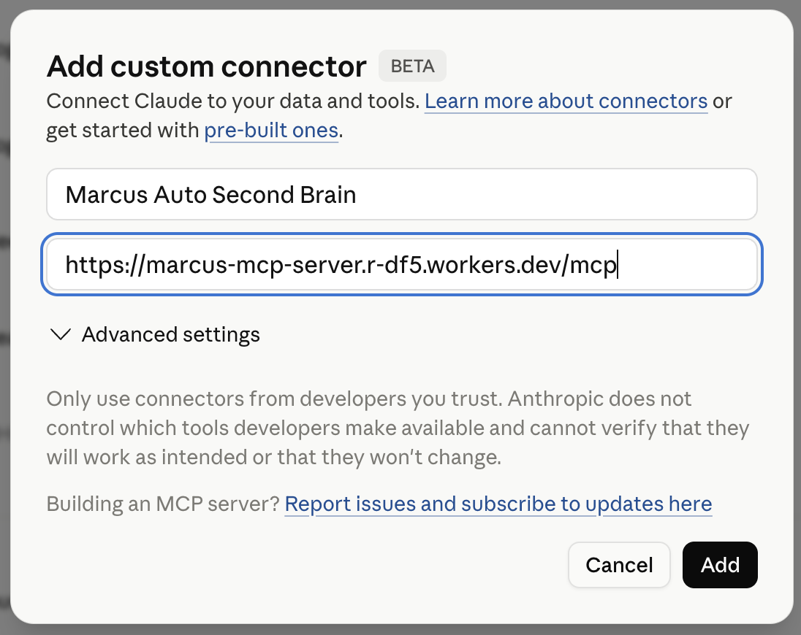

# Marcus - Second Brain

Marcus remembers everything you discuss with Claude, ChatGPT, and Perplexity — and stores it as private markdown notes in your own GitHub repository.

> Your notes live in **your** GitHub repo. Even if Marcus shuts down tomorrow, your data stays with you.

---

## How to connect Marcus to Claude

### Step 1. Open Connectors settings

Go to [claude.ai/settings/connectors](https://claude.ai/settings/connectors) and click **"Add custom connector"**.

### Step 2. Enter the Marcus URL

In the URL field, paste:

```
https://marcus-mcp-server.r-df5.workers.dev/mcp
```

Give it a name (e.g. **Marcus Second Brain**) and click **Add**.

<div align="center">
  
</div>

### Step 3. Authorize with GitHub

A popup will open asking you to sign in with GitHub. Marcus will create a private `marcus-second-brain-vault` repository in your account and install itself with read/write access to that repo only.

### Step 4. Start using Marcus in chat

1. Open a new chat in Claude
2. Click **+** in the bottom-left of the input field
3. Select **Connectors** and enable Marcus
4. Ask Claude to save something: *"Save this to my second brain"*

After adding on desktop, the connector automatically appears in the **Claude iPhone/Android app** too. Restart the app if it doesn't appear immediately.

---

## What Marcus can do

| Tool | What it does |
|---|---|
| `create_note` | Save a new note to your vault |
| `update_note` | Edit an existing note (replace, append, or prepend) |
| `get_note` | Read a specific note |
| `search_notes` | Search across all your notes |
| `list_structure` | See your vault folder structure |
| `append_to_daily_note` | Add an entry to today's daily note |
| `link_notes` | Connect two notes with a wikilink |
| `get_recent_notes` | Get your most recently updated notes |
| `delete_note` | Archive or permanently delete a note |

---

## Privacy

Marcus is **contentless by design**. Your note content never passes through or is stored on Marcus servers. Marcus only stores:

- A mapping from your Marcus user ID to your GitHub App installation ID
- Short-lived OAuth tokens (TTL 24h)

All writes go directly from Marcus to your private GitHub repository via short-lived installation tokens. The Marcus software is proprietary; the source repository is public for transparency only.

---

## Disconnect

To revoke Marcus access: go to [github.com/settings/installations](https://github.com/settings/installations), find Marcus, and click **Uninstall**. Your vault repo and all notes remain in your GitHub account.
